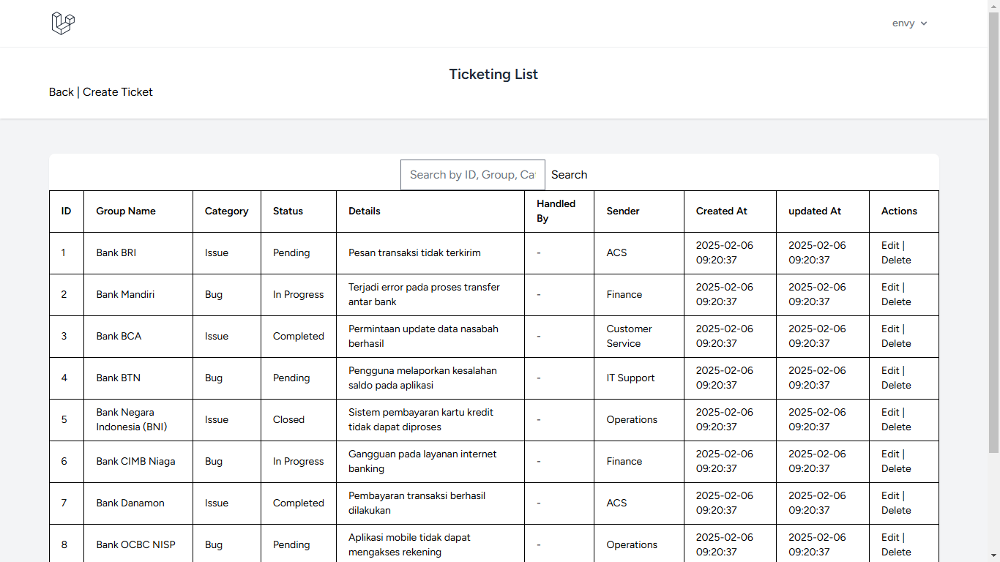
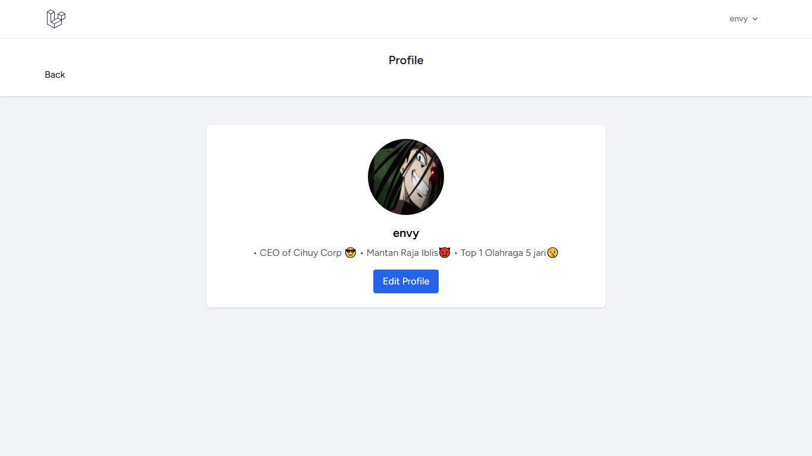

# 🎟️ Ticketing Project (Laravel 11 & Breeze)

## 📌 Pendahuluan

Proyek ini merupakan sistem ticketing berbasis Laravel 11 dengan autentikasi menggunakan Breeze.

## ✨ Fitur

-   🔐 Sistem Login & Register
-   👥 Role Admin & User
-   🎫 Sistem Ticket dengan CRUD
-   🔍 Fitur Search pada Ticket
-   👤 Menu Profile
-   🚪 Logout

## ⚙️ Persyaratan

-   🖥️ PHP 8.2 atau lebih
-   🎼 Composer
-   🌍 Node.js & NPM
-   🛢️ MySQL/PostgreSQL
-   🖥️ GitBash

## 📥 Instalasi

```bash
git clone https://github.com/envythe1st/Ticketing.git
cd Ticketing
npm install && npm run dev
```

## 🔧 Konfigurasi

1. Ubah file `.env` sesuai dengan pengaturan Anda, 
   - Contoh:
   DB_CONNECTION=mysql
   DB_HOST=127.0.0.1
   DB_PORT=3306
   DB_DATABASE=db_ticketing
   DB_USERNAME=root
   DB_PASSWORD=
2. Pada database/migration terdapat contoh tabel untuk kalian, kalian bisa jalankan perintah berikut untuk migrasi database:

```bash
php artisan migrate
php artisan db:seed
```

## 🎨 Tampilan Web

### 🔑 Tampilan Login


### 📝 Tampilan Register


### 🏠 Tampilan Dashboard


### 🎟️ Tampilan Ticketing



### ➕ Tampilan Create Ticket


### ✏️ Tampilan Edit Ticket


### 👤 Tampilan Profile



### 🖊️ Tampilan Edit Profile


### ⚙️ Tampilan Setting


