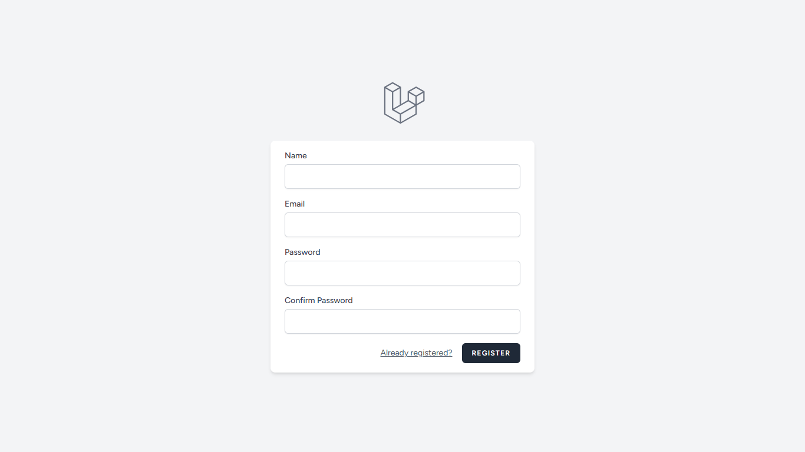
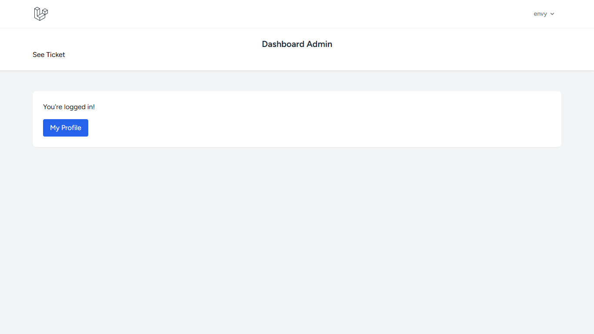
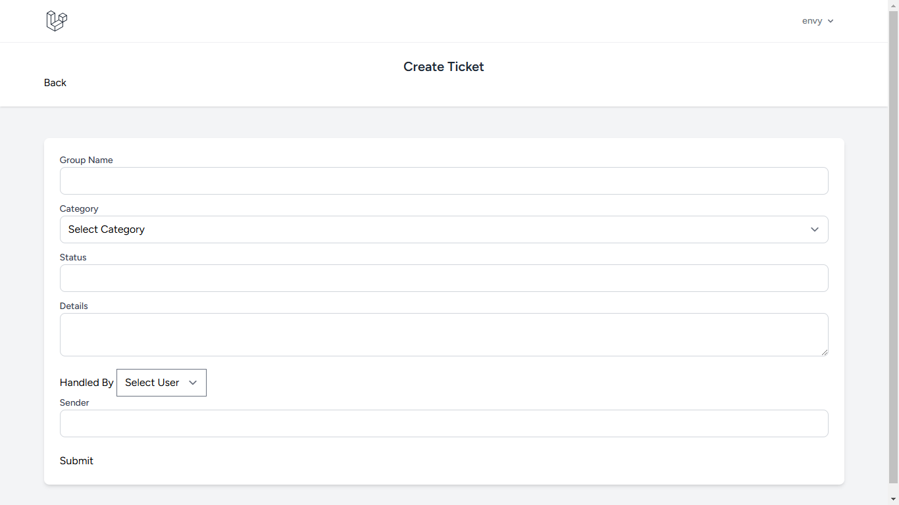
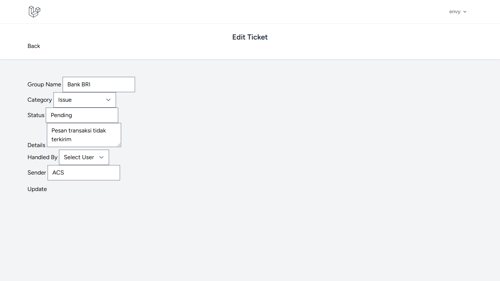
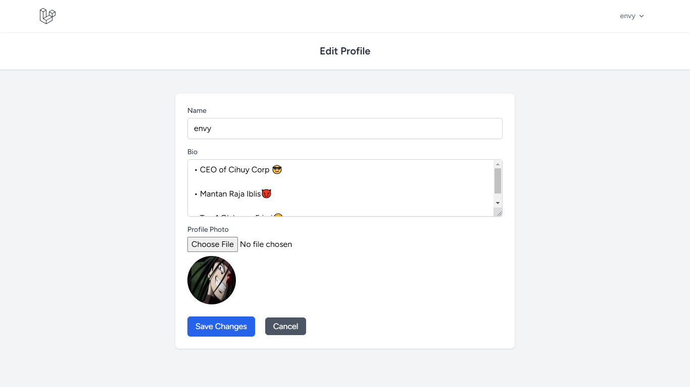
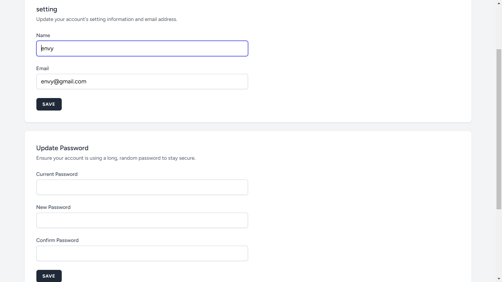

# Ticketing Projeck (Laravel 11 & Brezze)

## Pendahuluan
Berikut merupakan projek ticketing berbasis laravel 11 dan brezze

## Fitur
-   Sistem Login & Register
-   Admin & User
-   Sistem Ticket Dan CRUD
-   Menu Profile
-   Logout

## Persyaratan
-   PHP 8.2 Atau lebih
-   Composer
-   Node.js & NPM
-   MySQL/PostgreSQL
-   GitBash 

## Instalasi 
- git clone https://github.com/envythe1st/Ticketing.git
- npm install && npm run dev

## konfigurasi
- ubah .env dengan settingan mu
- Lakukan "php artisan migrate" 

## Tampilan Web
- Tampilan Login

- Tampilan Register

- Tampilan Dashboard

- Tampilan Ticketing

- Tampilan Create Ticket

- Tampilan Edit Ticket

- Tampilan Profile

- Tampilan Edit Profile

- Tampilan Setting

